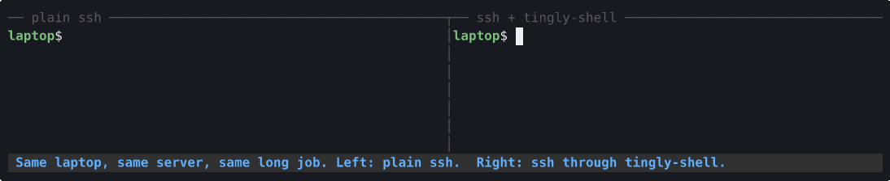

<div align="center">

# tingly-ssh

**Your SSH session doesn't drop anymore.**
Switch from Wi-Fi to 5G, close the lid, ride through a tunnel. The same `ssh` session picks up where it left off, and no output is lost.

English | [简体中文](README.zh-CN.md) · [Website](https://0x0079.github.io/tingly-ssh/)

[](https://github.com/0x0079/tingly-ssh/actions/workflows/ci.yml)
[](https://github.com/0x0079/tingly-ssh/releases)
[](LICENSE)



<sub>Recorded, not mocked up: the same long job over two ssh sessions, while a real laptop network namespace goes through an IP change and then 15 s with no network.
Left, plain <code>ssh</code> freezes at 15% and gives up. Right, through tingly-ssh, the bar pauses during the outage, catches up, and finishes.
The recording script checks that all 150 progress updates reached the terminal in order and exactly once. Reproduce it with <a href="demo/record.sh"><code>demo/record.sh</code></a>.</sub>

</div>

---

You keep using `ssh`, `scp`, `rsync`, `git`, `-L/-R/-D` forwarding, `ProxyJump`, tmux and everything else exactly as today.
**OpenSSH and sshd are not modified.** A small bridge at each end carries the connection over QUIC and a
resumable session layer, so a changed address or a short outage is something it recovers from, not
`client_loop: send disconnect: Broken pipe`.

## Is it for you?

**Yes, if you:**

- work from a laptop that moves between home, office, café and phone hotspot;
- start long builds, migrations or training jobs over SSH and hate babysitting the connection;
- keep `ssh -L` tunnels open to a database, Jupyter or an internal dashboard, and they die with the Wi-Fi;
- are on trains, planes or flaky mobile networks, where the network regularly disappears for 10 to 60 seconds;
- want this without a VPN, a hosted control plane or a new identity system.

**Probably not, if you:**

- need the session to survive a **reboot of either machine**: state lives in memory (see [limits](#status-and-known-limits));
- are on **Windows**: Linux and macOS only for now;
- sit behind a network that **blocks UDP** (some corporate networks): QUIC needs one UDP port, and a TCP fallback is on the [roadmap](docs/05-roadmap.md);
- mostly type over a **very high latency** link: [mosh](https://mosh.org)'s local echo prediction is the better tool for that.

## How it compares

|  | **tingly-ssh** | mosh | Eternal Terminal | autossh | tmux / screen alone |
| --- | --- | --- | --- | --- | --- |
| Survives an IP change | ✅ | ✅ | ✅ | ❌ reconnects as a new session | ❌ you reattach by hand |
| Survives a short outage | ✅ default 60 s, configurable | ✅ | ✅ | ❌ new session | ❌ you reattach by hand |
| Delivers **every byte** of output | ✅ | ❌ syncs the latest screen only | ✅ | ❌ | ✅ in the pane, not the connection |
| `scp`, `sftp`, `rsync`, `git` over SSH | ✅ | ❌ terminal only | ❌ terminal and tunnels | ✅ | ✅ |
| `-L` / `-R` / `-D` forwarding, agent forwarding | ✅ | ❌ | partial | ✅ | ✅ |
| Your scrollback works | ✅ | ❌ | ✅ | ✅ | ✅ |
| sshd unchanged, SSH auth and crypto unchanged | ✅ | ✅ uses ssh to bootstrap | ✅ | ✅ | ✅ |
| Server side | one daemon, one UDP port | `mosh-server`, UDP 60000–61000 | `etserver` daemon | nothing | nothing |
| Typing prediction on slow links | ❌ | ✅ | ❌ | ❌ | ❌ |

tingly-ssh and tmux do different jobs and work well together: the tunnel keeps the **connection** alive
across network changes, tmux keeps the **work** alive if the connection does die (for example when the laptop is off for an hour).

## Quick start

About five minutes. You need a Linux or macOS client, a Linux or macOS server running sshd, and one UDP port you can open.

### 1. Install on both machines

Prebuilt binaries for linux/darwin × amd64/arm64 are attached to every [release](https://github.com/0x0079/tingly-ssh/releases):

```bash
# Replace VERSION, OS (linux|darwin) and ARCH (amd64|arm64)
curl -LO https://github.com/0x0079/tingly-ssh/releases/download/vVERSION/tingly-ssh_VERSION_OS_ARCH.tar.gz
tar xzf tingly-ssh_VERSION_OS_ARCH.tar.gz
sudo install -m 755 tingly-ssh /usr/local/bin/
tingly-ssh version
```

Or with Go 1.26+: `go install github.com/0x0079/tingly-ssh/cmd/tingly-ssh@latest`.

### 2. Server: run it next to sshd

The tunnel reuses the SSH keys you already have. Its allow list is a plain `authorized_keys` file:

```bash
sudo mkdir -p /etc/tingly
sudo sh -c 'cat ~alice/.ssh/authorized_keys >> /etc/tingly/authorized_keys'

tingly-ssh server --listen :7443 --target 127.0.0.1:22 \
    --authorized-keys /etc/tingly/authorized_keys
# ... msg="server listening" addr=[::]:7443 pin=sha256:XUYr8w...   <- note the pin
```

Open **UDP** 7443 in your firewall or cloud security group. A [systemd unit](docs/09-migrating-from-ssh.md#23-启动systemd) is in the migration guide.

### 3. Client: one line in `~/.ssh/config`

Add a new alias next to your existing one, so you can compare the two and switch back at any time:

```sshconfig
Host myserver-roam
    HostName 203.0.113.10
    User alice
    ProxyCommand tingly-ssh proxy --server %h:7443
```

Make sure your key is in the agent (`ssh-add -l`), then connect:

```console
$ ssh myserver-roam
level=WARN msg="trusting this server key from now on" pin="sha256:XUYr8w..."
alice@myserver:~$
```

That one-time line works like SSH's "Are you sure you want to continue connecting": compare the pin with the one the server printed.

### 4. See it work

```bash
ssh myserver-roam 'while true; do date; sleep 1; done'
```

Now turn Wi-Fi off and on, switch to your phone's hotspot, or close the lid for half a minute. The clock
stops, then catches up with every second it missed. No re-login, no re-run.

Happy with it? Move the `ProxyCommand` line into your normal `Host` entry. To go back, delete the line.
The full walkthrough, including teams, SSH CAs, hardware keys and a troubleshooting table, is in
[Migrating from plain SSH](docs/09-migrating-from-ssh.md).

## How it works

```
             your laptop                                         your server
┌──────────────────────────────────┐                ┌──────────────────────────────────┐
│ ssh ─stdio─▶ tingly-ssh proxy  │═══ QUIC/UDP ══▶│ tingly-ssh server ─TCP─▶ sshd  │
└──────────────────────────────────┘                └──────────────────────────────────┘
                   └──────────── resumable session layer ────────────┘
```

Two mechanisms cover the two ways a connection breaks:

- **The address changes but packets still flow** (Wi-Fi to 5G, NAT rebinding): QUIC connection migration handles it, usually without you noticing.
- **The link is gone for a while** (tunnel, lid closed, dead hotspot): the session layer keeps every byte it has sent until the other side acknowledges it. When a new link comes up, both ends exchange how far they got and replay the rest, so the SSH stream sees neither a gap nor a duplicate.

SSH still does authentication and end-to-end encryption, and the tunnel never sees inside the SSH stream.
Details: [architecture](docs/01-architecture.md), [resumption semantics](docs/03-session-resumption.md),
[why a session layer above QUIC](docs/adr/0002-resumable-session-layer.md).

## Security in one paragraph

tingly-ssh is an **extra** layer around SSH, not a replacement: sshd still authenticates you and SSH still
encrypts everything end to end. To get through the tunnel at all, a client proves it holds a key that is in
the server's allow list. The proof is an SSH signature bound to that specific TLS connection, so it can't be
replayed and can't be reused as an SSH login. Nothing secret goes on the wire, which is why the tunnel's server
key can be trusted on first use like `known_hosts`. Revoking access means deleting a line and sending `SIGHUP`.
The full [threat model](docs/04-security-model.md) spells out what is protected, what the tunnel reveals,
the risk register, and a hardening checklist.

## More ways to use it

<details>
<summary><b>Per-device tokens</b> for CI and machines without an ssh-agent</summary>

```bash
tingly-ssh keygen --label ci-runner-1 > token && chmod 600 token   # record line goes to stderr
tingly-ssh server --listen :7443 --target 127.0.0.1:22 --credentials /etc/tingly/credentials
ssh -o ProxyCommand="tingly-ssh proxy --server %h:7443 --token-file token --pin sha256:..." user@host
```

The server stores only a hash. Each device gets its own token, so revoking one is deleting its line and sending `SIGHUP`.
Both methods can be enabled on the same server. Why you need both `--pin` and `--token-file`: [security model §2.1](docs/04-security-model.md).
</details>

<details>
<summary><b>Jump hosts</b> (laptop → bastion → internal machine)</summary>

Tunnel only the first hop and keep using stock `ProxyJump` after it. Only the first hop breaks when your
laptop changes networks, so the jump host itself needs no changes. See [jump host topologies](docs/08-jump-host-topologies.md).
</details>

<details>
<summary><b>A local port</b> instead of ProxyCommand</summary>

```bash
tingly-ssh client --server myserver:7443 --listen 127.0.0.1:2222
ssh -p 2222 alice@127.0.0.1
```
</details>

<details>
<summary><b>Tuning</b></summary>

| Flag | Where | What it controls |
| --- | --- | --- |
| `--session-linger` | client and server | how long an outage stays recoverable (default 60s) |
| `--idle-timeout`, `--keepalive` | client | how fast a dead link is noticed; laptops do well with `8s` / `2s` |
| `--window` | both | per-stream window, which also bounds replay memory |
| `--max-sessions` | server | bounds server memory. The server prints the worst case at startup, so size it for your real concurrency |

`kill -USR1` on a client or proxy forces an immediate reconnect, which is handy in a network-change hook.
</details>

## FAQ

**What happens if I'm offline for longer than the linger time?**
The session is abandoned and `ssh` exits normally, the same as today. Raise `--session-linger` (on both ends) if your outages run longer. Run your work inside tmux as the second line of defense.

**Does it make SSH faster?**
No, that isn't the goal. The goal is that it doesn't break. Performance work is on the [roadmap](docs/05-roadmap.md) (M5).

**Can the tunnel operator read my session?**
No. The bytes it carries are the SSH protocol, which is already encrypted end to end between your `ssh` and sshd.

**sshd now sees every connection coming from 127.0.0.1. Does that matter?**
It does for `from="..."` restrictions and IP-based tools like fail2ban on sshd. The server logs which key or device each session belongs to. See [security model, R-1](docs/04-security-model.md).

**Why QUIC and not MPTCP or WireGuard?**
MPTCP needs kernel support at both ends and silently falls back without it. WireGuard roams, but TCP connections inside it still die on long outages. The reasoning is in [ADR-0001](docs/adr/0001-transport-choice.md).

## How we know it works

Every push runs, against a **real sshd** with **real OpenSSH clients**:

- **18 end-to-end cases**: ProxyCommand, scp integrity, link destruction, a 30 s network black hole, the linger deadline, refused credentials, a two-hop chain through an unmodified jump host ([`test/e2e`](test/e2e/));
- **17 everyday-SSH scenarios**: an interactive pty, 32 MiB of output, all 256 byte values, Ctrl-C, window resize, `-L/-R/-D`, sftp, rsync, ControlMaster, tmux ([`test/scenarios`](test/scenarios/));
- **7 roaming cases**, measured by a remote counter: continuity proves nothing was lost or repeated, and the largest arrival gap is how long your terminal actually froze. The same suite drives real radios through `nmcli` or macOS ([`test/roaming`](test/roaming/));
- unit and fault-injection tests for the session layer, under `go test -race`.

The full acceptance checklist is the [verification plan](docs/07-verification-plan.md).

## Status and known limits

v0: the design, session layer, QUIC transport, bridges, CLI and test suites are done (milestones M0 to M2).
Known limits, each tracked on the [roadmap](docs/05-roadmap.md):

- a session does not survive a restart of the client or server process;
- UDP only; a TCP fallback for UDP-hostile networks is planned;
- Linux and macOS only;
- client-initiated path migration does not use quic-go's Path API yet (reconnects cover it today).

## Documentation

The design documents live in [`docs/`](docs/README.md) and are currently written in Chinese:
[scope](docs/00-vision-and-scope.md) · [architecture](docs/01-architecture.md) · [wire protocol](docs/02-wire-protocol.md) ·
[resumption](docs/03-session-resumption.md) · [security model](docs/04-security-model.md) · [roadmap](docs/05-roadmap.md) ·
[testing](docs/06-testing.md) · [verification plan](docs/07-verification-plan.md) · [jump hosts](docs/08-jump-host-topologies.md) ·
[migrating from SSH](docs/09-migrating-from-ssh.md) · ADRs [0001](docs/adr/0001-transport-choice.md) [0002](docs/adr/0002-resumable-session-layer.md) [0003](docs/adr/0003-library-choices.md) [0004](docs/adr/0004-client-identity.md)

## Contributing

Issues and pull requests are welcome. Before sending code:

```bash
gofmt -l . && go vet ./... && go test -race ./...
./test/e2e/run.sh && ./test/scenarios/run.sh    # need OpenSSH; neither touches your SSH config
```

The project has two direct dependencies, [quic-go](https://github.com/quic-go/quic-go) and `golang.org/x/crypto`,
and would like to keep it that way ([ADR-0003](docs/adr/0003-library-choices.md)). The website lives in [`site/`](site/).

## License

[Mozilla Public License 2.0](LICENSE)
